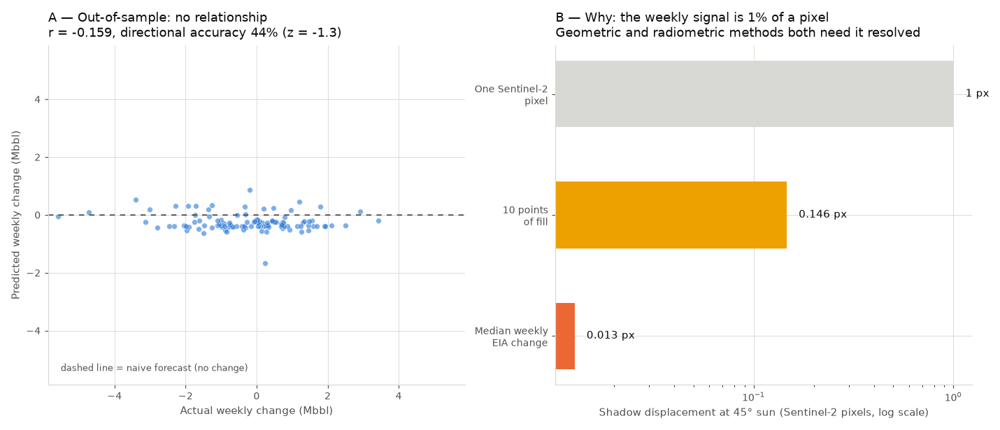
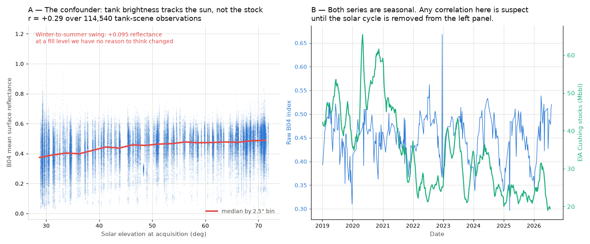

# Cushing Storage Nowcast

Estimating weekly crude oil inventories at Cushing, Oklahoma from free satellite
imagery, benchmarked against the EIA weekly series.

**Status:** complete, with a negative result. The full pipeline runs end to end
over 2019–2026. It does not beat a naive forecast, and the reason is measured
rather than guessed: the weekly signal is **1.3% of a Sentinel-2 pixel**. See
[Results](#results).

---

## Why Cushing

Cushing is the physical delivery point for the WTI futures contract. When a
contract goes to delivery, the barrels change hands there. Inventory levels at
the hub therefore feed directly into the term structure of US crude: a hub
filling toward capacity pushes the market into contango, a hub draining tightens
it. April 2020 was the extreme case, when Cushing approached capacity and WTI
settled below zero.

It is also an unusually good place to learn. The EIA publishes the real number
every Wednesday, which means the estimate is scorable week after week against an
independent, public source. Most alternative data problems never get that.

The point of the exercise is not to beat the EIA. Their number comes from direct
operator reporting and will always be more accurate than mine. The point is to
know it before it is published.

## The physical idea

Crude tanks use external floating roofs: the roof sits on the product and
descends with it. Seen from above the oil is invisible, but the tank wall casts a
shadow onto the roof, and that shadow grows as the roof drops.

```
h    = L * tan(theta)        # height of wall above the roof
fill = (H - h) / H
V    = pi * r^2 * (H - h)
```

`L` is shadow length, `theta` is solar elevation from scene metadata, `H` is tank
height and `r` its radius.

### Why the geometric method does not work here

Sentinel-2 resolves 10 m per pixel. A Cushing tank is 60–100 m across, so roughly
six to ten pixels wide. A shadow corresponding to five metres of exposed wall
under a 45° sun is five metres on the ground: **half a pixel**. The shadow cannot
be measured directly. This is why commercial providers buy 50 cm imagery.

### What is done instead

A radiometric approach. Rather than measuring a shadow that cannot be resolved,
the pipeline measures mean reflectance inside the tank footprint. A lower roof
produces more shadowed area and a darker tank overall, even when the shadow
itself is sub-pixel. The signal survives pixel aggregation; the length
measurement does not.

The cost of this choice is explicit: it replaces a physical inversion with a
statistical calibration. The pipeline does not observe a volume, it learns a
relationship between brightness and volume.

## The main confounder

Solar elevation at this latitude ranges from about 30° in December to 75° in
June. At rigorously constant fill, a tank looks darker in winter because the cast
shadow is longer.

Left uncorrected, the pipeline measures the season rather than the stock. Since
Cushing inventories are themselves seasonal, this yields a flattering correlation
carrying no information. Two independent corrections are implemented and
compared: nuisance regression on `sin(solar_elevation)`, and matching
observations within a ±5° elevation window.

## How this is evaluated

**The trap** is correlating levels. Cushing inventories have a slow trend and
strong seasonality, so a mediocre proxy will show 0.85 on levels while containing
nothing useful.

**The real test** is week-over-week change, which is what the market reacts to on
Wednesday morning. Reported out-of-sample:

| Metric | Meaning |
|---|---|
| `corr_weekly_change` | the metric that matters |
| `directional_accuracy` | share of weeks with the correct sign |
| `mae_mbbl` | mean absolute error, million barrels |
| `mae_vs_naive` | versus a no-change forecast |
| `coverage_pct` | usable weeks after cloud masking |
| `corr_levels` | reported for honesty, not informative |

If the pipeline does not beat "this week's change is zero", it has produced
nothing.

### Temporal integrity

- Strictly chronological splits, `TimeSeriesSplit`, never shuffled.
- The EIA figure dated Friday V may only use imagery acquired on or before
  Friday V. The number is published the following Wednesday; a Saturday image is
  a leak.
- Normalisation parameters fit on the training window only.
- Linear or Ridge regression only. With ~250 autocorrelated weekly observations,
  a flexible model would fit the seasonality and call it signal.

## Known limitations

- **Fixed-roof tanks carry no fill signal at all.** A meaningful share of Cushing
  tanks have them. They are detected by near-zero temporal variance in
  reflectance and excluded; the residual misclassification is an open error
  source.
- **Tank height is not observable at nadir** and is assumed by radius class,
  which introduces a systematic per-tank bias. Sensitivity is tested at ±20%.
- **Cloud gaps are not missing at random.** They are seasonal and weather-linked,
  so the missing weeks are not a random subsample.
- **Inventory completeness.** A permanently missing tank is absorbed by
  calibration; a tank built or decommissioned mid-period breaks the relationship.
- **Resolution.** This turned out to be the binding constraint, not one
  limitation among several. Quantified under [Results](#results).
- **Roof type was never resolved.** Fixed-roof tanks carry no fill signal and
  should be excluded. Detection by temporal variance was attempted and is
  inconclusive: the per-tank standard deviation is tightly unimodal
  (q10 = 0.063, q90 = 0.105), with no separation between the two populations —
  consistent with a regime where no tank carries much fill signal to begin with.
  Reported as unresolved rather than papered over with a threshold.

## Progress

- [x] **EIA ground truth** — 394 weekly observations, 2019 to present, no
      duplicates, no gap beyond 8 days, publication lag verified at 5 days
- [x] **Tank inventory, first pass** — 416 OpenStreetMap elements from Overpass,
      415 storage-tank footprints, visually checked against a recent Sentinel-2 scene
- [x] **Tank geometry and capacity cross-check** — radius measured from footprint
      vertices, wall height as a documented assumption, 98.4 Mbbl total shell
      capacity against 97.7 Mbbl reported by the EIA (ratio 1.01)
- [x] **Sentinel-2 acquisition** — 1295 STAC items reduce to 560 distinct
      acquisitions after removing 727 MGRS tile duplicates; 339 clear enough to
      use, covering 273 of 395 EIA weeks (69.1%)
- [x] **Signal extraction** — 114,540 tank-scene observations, 415 tanks,
      276 dates, with two silent data defects found and fixed (see below)
- [x] **Calibration and out-of-sample validation** — chronological splits,
      nuisance regression fitted on training folds only
- [ ] Roof type classification — attempted via temporal variance, inconclusive
      (see limitations)


*Ground truth: 394 weekly observations in thousand barrels — the series every estimate is scored against.*


*First-pass inventory: 416 OpenStreetMap footprints on Sentinel-2, 27 July 2026 — the inset shows both the alignment and the tanks OSM still misses.*


*Built inventory: 415 tanks with computed radius and shell capacity — the top 10% hold only 19–22% of it, so the index is mutualised rather than driven by a few large tanks.*

## Results

The pipeline does not work. Reported in full, because a proxy that fails a fair
test is worth more than one that passes a rigged one.

| Metric | Value | Reading |
|---|---|---|
| `corr_weekly_change` | **−0.159** | the metric that matters — no relationship |
| `directional_accuracy` | 43.6% (z = −1.3) | not distinguishable from chance |
| `mae_mbbl` | 1.195 | |
| `mae_naive_mbbl` | 1.124 | forecasting "no change" |
| `mae_vs_naive` | **1.063** | worse than doing nothing |
| `coverage_pct` | 69.1% | EIA weeks with a usable scene |

110 out-of-sample weeks, chronological splits only.



*Left: predictions cluster near zero with no diagonal structure. Right: why — the shadow displacement to be detected, on a log scale.*

### Why it fails, quantified

The median weekly EIA change is 853 kbbl against 98.4 Mbbl of inventory
capacity: **0.87% of fill per week**. On a 14.63 m wall that is 12.7 cm of newly
exposed steel, casting **0.013 of a Sentinel-2 pixel** of extra shadow at a 45°
sun.

This is not a tuning problem. No filter recovers it — restricting to large
tanks, to high-variance tanks, or to near-perfect pixel coverage all leave the
correlation between +0.04 and +0.06. Sub-metre imagery is not a luxury for this
problem; it is the threshold below which the measurement does not exist. That is
what commercial providers are buying.

### The solar confounder is real and was removed



*Reflectance rises by 0.095 from winter to summer sun at a fill level we have no reason to think changed (r = +0.29, 114,540 observations). Uncorrected, this alone would produce a flattering and entirely spurious correlation with the seasonal EIA series.*

### Two silent data defects

Both produce plausible wrong numbers rather than errors, and neither is
advertised by the STAC catalogue.

**Processing baseline 04.00** (25 Jan 2022) introduced `BOA_ADD_OFFSET = -1000`.
Measured on clear October scenes: B04 median 897/766/709 DN before, 2136/1710/1952
after. Uncorrected, that is a +0.1 reflectance step in the middle of the study
period, which calibration would read as a change in stock level.

**The SCL cloud classifier reads bright tank roofs as cloud.** On a scene with
0.14% cloud cover it masked 86% of tank pixels — but only 30% at 20 m from the
footprints, 2.8% at 50 m and 1.4% at 150 m. That decay with distance is a
per-pixel classification error, not a cloud; a real cloud at 10 m resolution
masks a contiguous blob. Applying SCL inside footprints drops the *brightest*
tanks preferentially, making the missing data correlated with the quantity being
measured. Cloudiness is now judged on a 50–150 m ring around each tank, where
SCL is reliable, and never on the tank itself. Fixing this recovered one test
scene from 21 usable tanks to 415.

## Running it

```bash
git clone https://github.com/SimonB51/cushing-nowcast
cd cushing-nowcast
conda env create -f environment.yml     # GDAL makes conda the safer route
conda activate cushing

cp .env.example .env                    # add your free EIA API key
python scripts/01_fetch_eia.py
python scripts/02_build_inventory.py
python scripts/02b_osm_coverage_figure.py   # regenerates the coverage figure above
python scripts/02c_inventory_figure.py      # regenerates the inventory figure above

python scripts/03_scene_inventory.py        # STAC metadata only, no pixels
python scripts/04_extract_signal.py         # ~15 min, resumable
python scripts/04b_confounder_figure.py
python scripts/05_validate.py               # the metrics table above
```

Run them in order: `02b` and `02c` both read what `02` writes, and the ground
truth tests skip themselves until `01` has produced the CSV.

A free EIA API key is available at
[eia.gov/opendata](https://www.eia.gov/opendata/).

## Layout

```
config/          AOI, dates, thresholds, tank inventory (tanks.geojson)
src/cushing/     eia, inventory, imagery, signal
scripts/         one runnable script per stage
outputs/         figures and validation metrics
tests/           21 tests
```

Modules and artefacts listed as "to come" track the unchecked items under
[Progress](#progress); they are not in the repository yet.

---

Simon Baudart — incoming MS Financial Engineering, NYU Tandon
