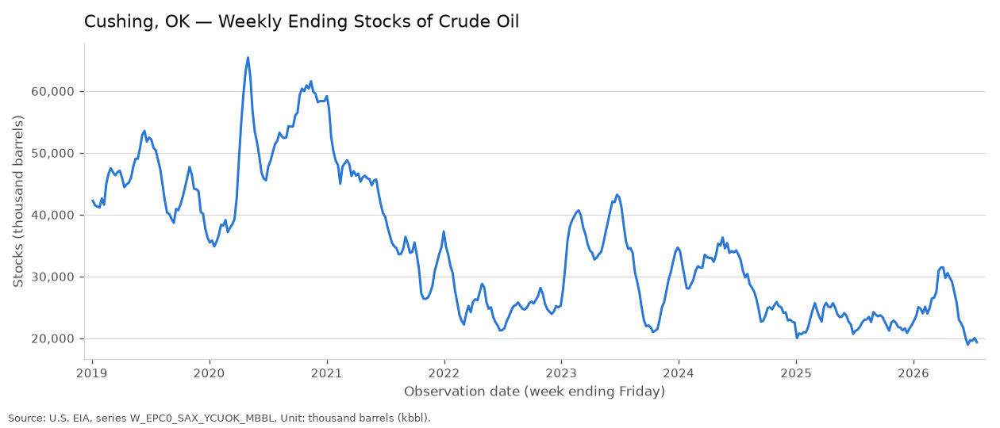
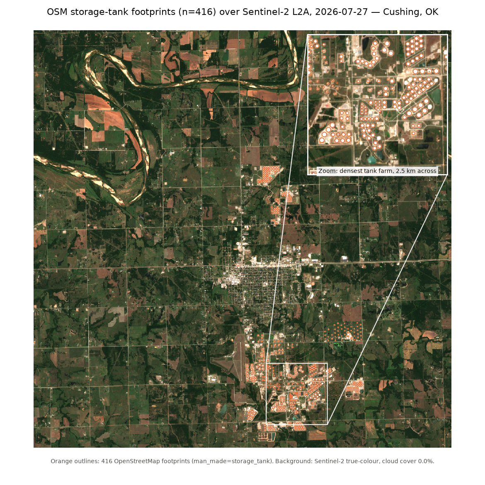
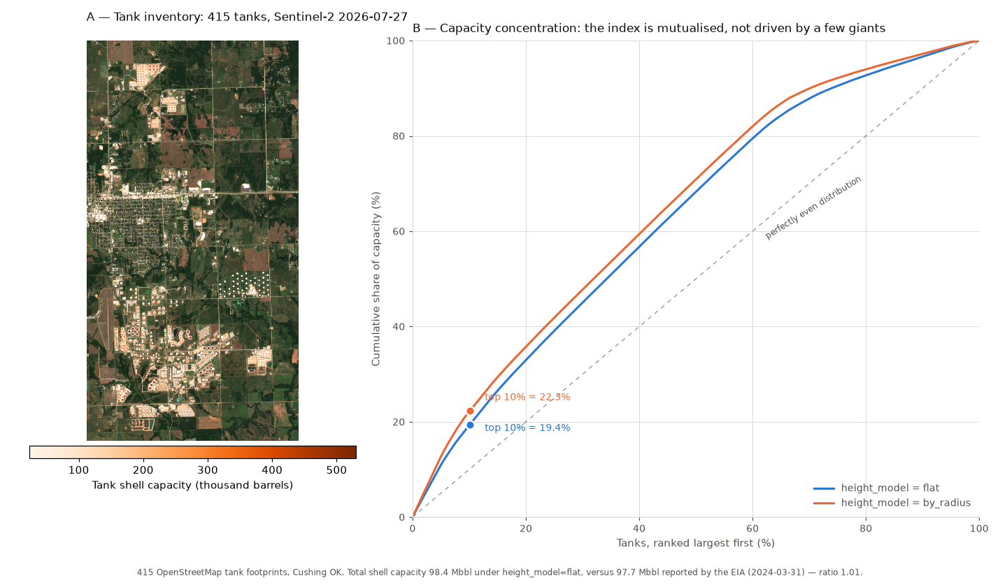

# Cushing Storage Nowcast

Estimating weekly crude oil inventories at Cushing, Oklahoma from free satellite
imagery, benchmarked against the EIA weekly series.

**Status:** in progress. Ground truth pipeline and tank inventory are working;
imagery, signal extraction and validation are being built. See
[Progress](#progress) below.

---

## Why Cushing

Cushing is the physical delivery point for the WTI futures contract. When a
contract goes to delivery, the barrels change hands there. Inventory levels at
the hub therefore feed directly into the term structure of US crude: a hub
filling toward capacity pushes the market into contango, a hub draining tightens
it. April 2020 was the extreme case, when Cushing approached capacity and WTI
settled below zero.

It is also an unusually good place to learn. The EIA publishes the real number
every Wednesday, which means the estimate is scorable week after week against an
independent, public source. Most alternative data problems never get that.

The point of the exercise is not to beat the EIA. Their number comes from direct
operator reporting and will always be more accurate than mine. The point is to
know it before it is published.

## The physical idea

Crude tanks use external floating roofs: the roof sits on the product and
descends with it. Seen from above the oil is invisible, but the tank wall casts a
shadow onto the roof, and that shadow grows as the roof drops.

```
h    = L * tan(theta)        # height of wall above the roof
fill = (H - h) / H
V    = pi * r^2 * (H - h)
```

`L` is shadow length, `theta` is solar elevation from scene metadata, `H` is tank
height and `r` its radius.

### Why the geometric method does not work here

Sentinel-2 resolves 10 m per pixel. A Cushing tank is 60–100 m across, so roughly
six to ten pixels wide. A shadow corresponding to five metres of exposed wall
under a 45° sun is five metres on the ground: **half a pixel**. The shadow cannot
be measured directly. This is why commercial providers buy 50 cm imagery.

### What is done instead

A radiometric approach. Rather than measuring a shadow that cannot be resolved,
the pipeline measures mean reflectance inside the tank footprint. A lower roof
produces more shadowed area and a darker tank overall, even when the shadow
itself is sub-pixel. The signal survives pixel aggregation; the length
measurement does not.

The cost of this choice is explicit: it replaces a physical inversion with a
statistical calibration. The pipeline does not observe a volume, it learns a
relationship between brightness and volume.

## The main confounder

Solar elevation at this latitude ranges from about 30° in December to 75° in
June. At rigorously constant fill, a tank looks darker in winter because the cast
shadow is longer.

Left uncorrected, the pipeline measures the season rather than the stock. Since
Cushing inventories are themselves seasonal, this yields a flattering correlation
carrying no information. Two independent corrections are implemented and
compared: nuisance regression on `sin(solar_elevation)`, and matching
observations within a ±5° elevation window.

## How this is evaluated

**The trap** is correlating levels. Cushing inventories have a slow trend and
strong seasonality, so a mediocre proxy will show 0.85 on levels while containing
nothing useful.

**The real test** is week-over-week change, which is what the market reacts to on
Wednesday morning. Reported out-of-sample:

| Metric | Meaning |
|---|---|
| `corr_weekly_change` | the metric that matters |
| `directional_accuracy` | share of weeks with the correct sign |
| `mae_mbbl` | mean absolute error, million barrels |
| `mae_vs_naive` | versus a no-change forecast |
| `coverage_pct` | usable weeks after cloud masking |
| `corr_levels` | reported for honesty, not informative |

If the pipeline does not beat "this week's change is zero", it has produced
nothing.

### Temporal integrity

- Strictly chronological splits, `TimeSeriesSplit`, never shuffled.
- The EIA figure dated Friday V may only use imagery acquired on or before
  Friday V. The number is published the following Wednesday; a Saturday image is
  a leak.
- Normalisation parameters fit on the training window only.
- Linear or Ridge regression only. With ~250 autocorrelated weekly observations,
  a flexible model would fit the seasonality and call it signal.

## Known limitations

- **Fixed-roof tanks carry no fill signal at all.** A meaningful share of Cushing
  tanks have them. They are detected by near-zero temporal variance in
  reflectance and excluded; the residual misclassification is an open error
  source.
- **Tank height is not observable at nadir** and is assumed by radius class,
  which introduces a systematic per-tank bias. Sensitivity is tested at ±20%.
- **Cloud gaps are not missing at random.** They are seasonal and weather-linked,
  so the missing weeks are not a random subsample.
- **Inventory completeness.** A permanently missing tank is absorbed by
  calibration; a tank built or decommissioned mid-period breaks the relationship.
- **Resolution.** Commercial operators use sub-metre imagery and, in some cases,
  drone-based infrared. This pipeline is resolution-limited by construction.

## Progress

- [x] **EIA ground truth** — 394 weekly observations, 2019 to present, no
      duplicates, no gap beyond 8 days, publication lag verified at 5 days
- [x] **Tank inventory, first pass** — 416 OpenStreetMap elements from Overpass,
      415 storage-tank footprints, visually checked against a recent Sentinel-2 scene
- [x] **Tank geometry and capacity cross-check** — radius measured from footprint
      vertices, wall height as a documented assumption, 98.4 Mbbl total shell
      capacity against 97.7 Mbbl reported by the EIA (ratio 1.01)
- [ ] Roof type classification — needs the multi-date imagery of the next stage
- [ ] Sentinel-2 acquisition and cloud masking
- [ ] Signal extraction and solar normalisation
- [ ] Calibration and out-of-sample validation
- [ ] Error decomposition



*Ground truth: 394 weekly observations in thousand barrels — the series every estimate is scored against.*



*First-pass inventory: 416 OpenStreetMap footprints on Sentinel-2, 27 July 2026 — the inset shows both the alignment and the tanks OSM still misses.*



*Built inventory: 415 tanks with computed radius and shell capacity — the top 10% hold only 19–22% of it, so the index is mutualised rather than driven by a few large tanks.*

## Running it

```bash
git clone https://github.com/SimonB51/cushing-nowcast
cd cushing-nowcast
conda env create -f environment.yml     # GDAL makes conda the safer route
conda activate cushing

cp .env.example .env                    # add your free EIA API key
python scripts/01_fetch_eia.py
python scripts/02_build_inventory.py
python scripts/02b_osm_coverage_figure.py   # regenerates the coverage figure above
python scripts/02c_inventory_figure.py      # regenerates the inventory figure above
```

Run them in order: `02b` and `02c` both read what `02` writes, and the ground
truth tests skip themselves until `01` has produced the CSV.

A free EIA API key is available at
[eia.gov/opendata](https://www.eia.gov/opendata/).

## Layout

```
config/          AOI, dates, thresholds, tank inventory (tanks.geojson)
src/cushing/     eia, inventory, imagery  ·  signal, aggregate, validate to come
scripts/         one runnable script per stage
outputs/         figures
tests/
```

`imagery` currently covers scene selection only; cloud masking, solar metadata
and local caching arrive with the acquisition stage.

Modules and artefacts listed as "to come" track the unchecked items under
[Progress](#progress); they are not in the repository yet.

---

Simon Baudart — incoming MS Financial Engineering, NYU Tandon
